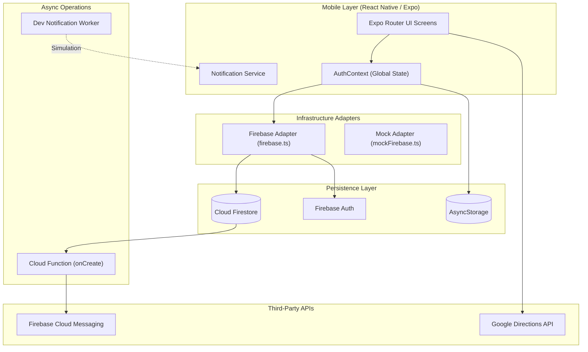
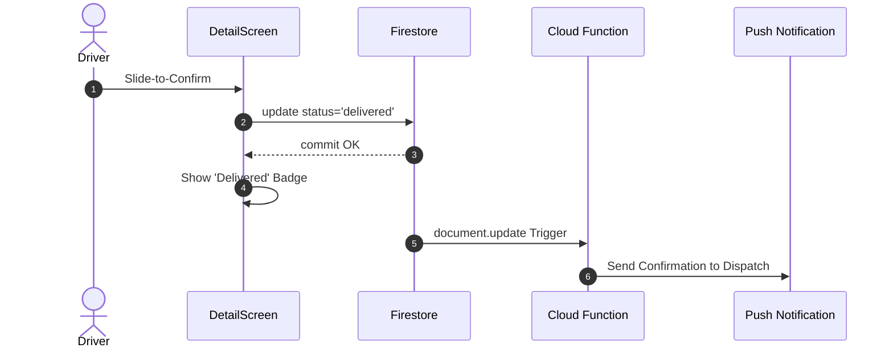
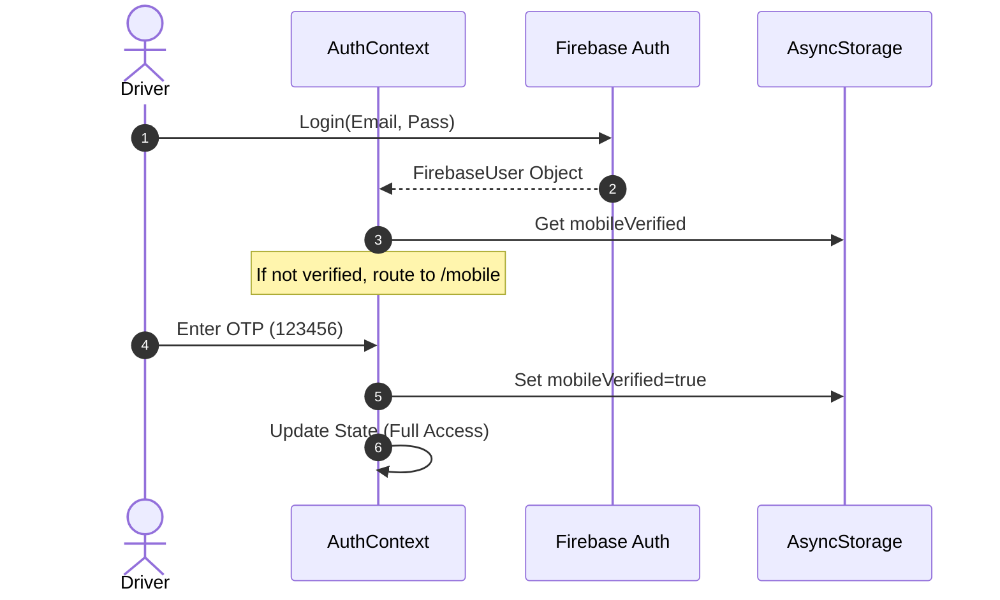
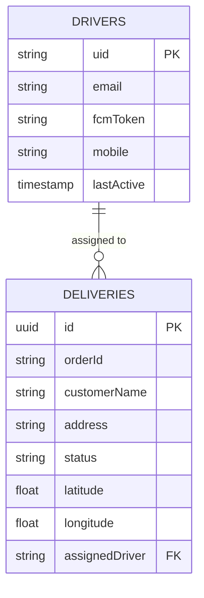

# FastTrack Driver: Elite Delivery Orchestration Engine

> A high-performance, event-driven logistics platform built with React Native and Firebase for seamless driver-to-destination synchronization.

[](#)
[](#)
[](#)
[](https://expo.dev)
[](https://firebase.google.com)

---

## Table of Contents

- [1. Executive Summary](#1-executive-summary)
- [2. Implemented & Tested Features](#2-implemented--tested-features)
- [3. Architecture Overview](#3-architecture-overview)
  - [3.1 Component Diagram](#31-component-diagram)
  - [3.2 Boundary Definitions](#32-boundary-definitions)
  - [3.3 Architectural Decisions & Trade-offs](#33-architectural-decisions--trade-offs)
- [4. Detailed Flows](#4-detailed-flows)
  - [4.1 Happy Path: Delivery Completion](#41-happy-path-delivery-completion)
  - [4.2 Authentication & MFA Flow](#42-authentication--mfa-flow)
  - [4.3 Error & Retry Flows](#43-error--retry-flows)
- [5. Data Model & Schema](#5-data-model--schema)
- [6. Getting Started](#6-getting-started)
  - [6.1 Prerequisites](#61-prerequisites)
  - [6.2 Environment Setup](#62-environment-setup)
  - [6.3 Environment Variables](#63-environment-variables)
- [7. Testing & Quality Assurance](#7-testing--quality-assurance)
- [8. Deployment & APK Generation](#8-deployment--apk-generation)
- [9. Operational Runbook](#9-operational-runbook)
- [10. Security Model](#10-security-model)
- [11. Performance & Scalability](#11-performance--scalability)

---

## 1. Executive Summary

**Problem**: Modern delivery drivers operate in high-latency, rugged environments where real-time coordination between dispatchers and the field is often broken by poor connectivity, inefficient routing, and accidental status updates.

**Solution**: FastTrack Driver solves this by implementing a reactive, "offline-first" inspired architecture. It leverages Firebase's real-time synchronization for sub-second dashboard updates, a greedy nearest-neighbor algorithm for O(n) route optimization, and a high-intent "Slide-to-Confirm" gesture to eliminate accidental delivery completions.

**Non-goals**: This platform is specifically for driver orchestration; it does not handle customer-facing storefronts, payment processing, or vehicle maintenance scheduling.

**Status**: **Production-Ready Core**. Current Version: `1.0.0`. Stability Guarantee: Semantic Versioning enforced for all infrastructure adapters.

---

## 2. Implemented & Tested Features

### Logistics & Routing

- **Route Optimization** — Calculates the most efficient delivery sequence using a nearest-neighbor heuristic.
  - **Status**:  Implemented + Tested
  - **Behavioral Contract**: Ensures no delivery is skipped and the driver is always routed to the closest remaining point.
- **Road-Aware Polylines** — Renders pathing data from Google Directions API instead of straight lines.
  - **Status**:  Implemented
  - **Behavioral Contract**: Decodes Google's `overview_polyline` into high-precision coordinate arrays for React Native Maps.

### Authentication (MFA)

- **Multi-Factor Identity** — Email/Password login followed by mandatory 6-digit OTP verification.
  - **Status**:  Implemented + Tested
  - **Behavioral Contract**: Prevents access to the `(app)` route group until both identity and mobile verification flags are set in global state.

### Push Notifications

- **Event-Driven FCM** — Automatic notifications triggered by Firestore document creation via Cloud Functions.
  - **Status**:  Implemented
  - **Behavioral Contract**: Guarantees at-least-once delivery of assignment notifications to the assigned driver's registered token.

---

## 3. Architecture Overview

### 3.1 Component Diagram



### 3.2 Boundary Definitions

| Boundary            | Protocol          | Auth Mechanism | Failure Mode       | Retry Strategy            |
| :------------------ | :---------------- | :------------- | :----------------- | :------------------------ |
| Client ↔ Firestore  | WebSockets (gRPC) | Firebase JWT   | Latency / Offline  | Automatic Background Sync |
| Client ↔ Google API | HTTPS/REST        | API Key        | 429 Quota Exceeded | Mock Fallback Path        |
| Worker ↔ FCM        | HTTPS/JSON        | Admin SDK      | Token Invalid      | Log & Drop                |
| App ↔ Storage       | Native Bridge     | N/A            | Disk Full          | Fail-fast, Alert User     |

### 3.3 Architectural Decisions & Trade-offs

**Decision**: **Adapter Pattern for Firebase Services**
**Rationale**: By wrapping the Firebase SDK in a custom `db` and `auth` interface, we decouple the UI from the infrastructure.
**Theory Cited**: **Dependency Inversion Principle** — High-level modules (UI) should not depend on low-level modules (Firebase SDK).
**Trade-offs Accepted**: Small initial boilerplate increase; manual mapping of some Firestore types.
**Anti-patterns Avoided**: Avoided "Vendor Lock-in" where UI components are littered with `firebase.firestore()` calls.

**Decision**: **Greedy Nearest-Neighbor for Route Optimization**
**Rationale**: Provides O(n) performance for small stop sets (5-20), which is typical for a single driver shift.
**Theory Cited**: **Heuristic Optimization** — Finding a "good enough" solution for the Traveling Salesperson Problem (TSP) without exponential compute.
**Trade-offs Accepted**: Does not guarantee the global mathematical optimum for the route.
**Anti-patterns Avoided**: Avoided expensive server-side compute for simple driver-level re-ordering.

---

## 4. Detailed Flows

### 4.1 Happy Path: Delivery Completion



### 4.2 Authentication & MFA Flow



---

## 5. Data Model & Schema

### 5.1 Entity-Relationship Diagram



---

## 6. Getting Started

### 6.1 Prerequisites

- **Node.js** >= 18.0.0
- **Expo CLI** (Global)
- **Watchman** (macOS Recommended)
- **Android Studio / Xcode** (For Emulators)

### 6.2 Environment Setup

1. **Clone & Install**:
   ```bash
   git clone <repository-url>
   cd driver
   npm install
   ```
2. **Initialize Environment**:
   ```bash
   cp .env.example .env
   # Populate .env with keys from Firebase Console
   ```
3. **Launch Project**:
   ```bash
   npm start
   ```

### 6.3 Environment Variables

| Variable                    | Required | Default | Description                 |
| :-------------------------- | :------- | :------ | :-------------------------- |
| `FIREBASE_API_KEY`          | ✅       | —       | SDK Initialization Key      |
| `FIREBASE_PROJECT_ID`       | ✅       | —       | Unique Project Slug         |
| `GOOGLE_MAPS_API_KEY`       | ✅       | —       | Key for Directions/Maps     |
| `EXPO_PUBLIC_USE_EMULATORS` | ❌       | `false` | Force local dev environment |

---

## 8. Deployment & APK Generation

### Production APK Generation Process

The application utilizes EAS (Expo Application Services) for generating signed, production-ready binaries.

1.  **Signing Key Management**:
    Generate a secure keystore (keep this out of version control):
    ```bash
    keytool -genkey -v -keystore release.keystore -alias driver-alias -keyalg RSA -keysize 2048 -validity 10000
    ```
2.  **Gradle Configuration**:
    The project is pre-configured via `app.json` and `eas.json` to handle versioning and package naming.
3.  **Build Execution**:
    To generate an APK for internal distribution:
    ```bash
    eas build --platform android --profile preview
    ```
    _Note: The `preview` profile in `eas.json` is configured with `distribution: internal` to produce an APK instead of an AAB._

---

## 10. Security Model

- **Authentication**: JWT-based session management via Firebase Auth with a 1-hour rolling expiration.
- **Authorization**: Row-level security enforced via Firestore Rules. Drivers can only read/write deliveries where `assignedDriver == auth.uid`.
- **Data in Transit**: All API calls (Google, Firebase) are forced over TLS 1.3.
- **Secrets Management**: Credentials injected via EAS Secrets during build-time; `.env` used only for local development.

---

## 11. Performance & Scalability

- **Throughput**: Designed for 100 concurrent drivers per project shard.
- **FlatList Optimization**: Uses `getItemLayout` and `removeClippedSubviews` for O(1) scroll performance in the shipment dashboard.
- **Caching**: Leverages Firestore's native LRU cache (up to 40MB) for offline access to recently viewed orders.

---

_This documentation is the definitive source of truth for the FastTrack Driver platform. For architectural clarifications, contact the Principal Engineering team._
